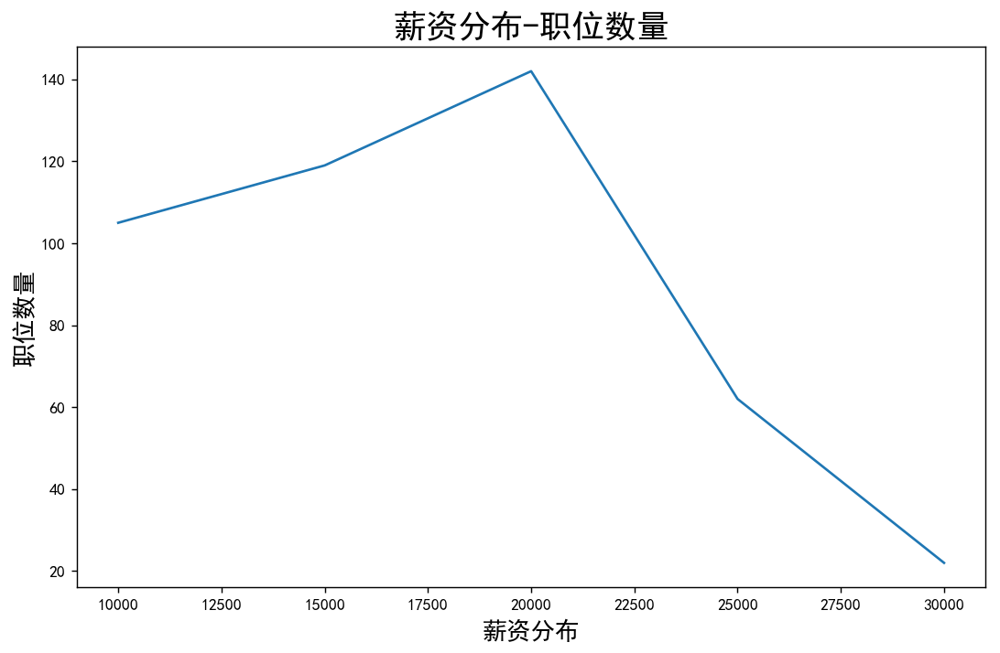
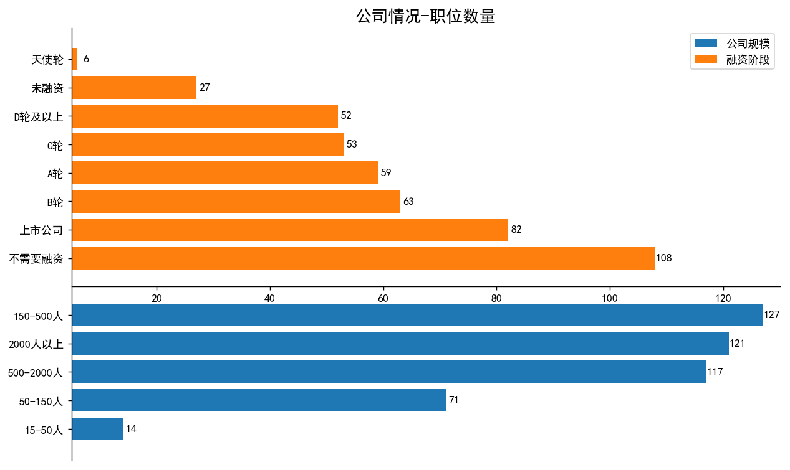
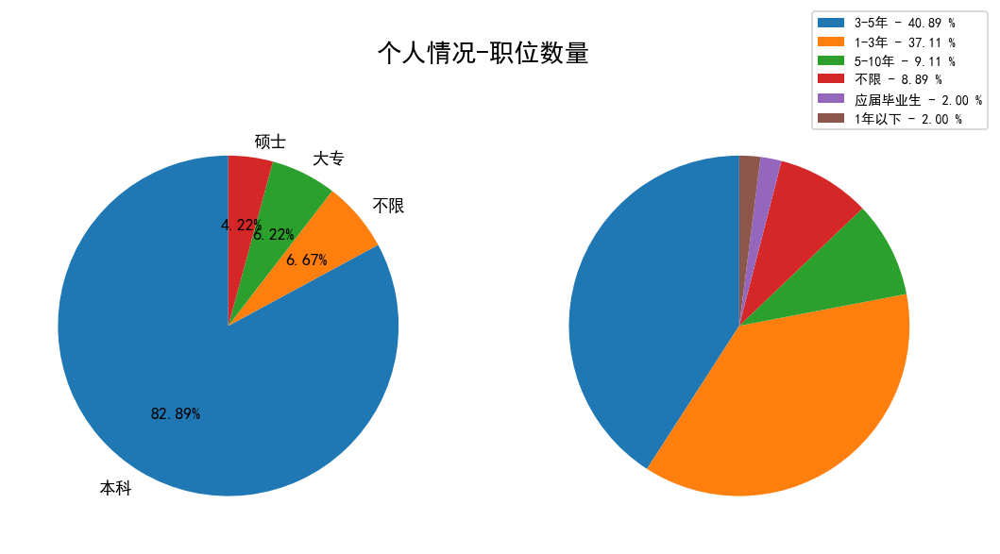

# 拉钩职位分析（数据分析岗位）

## 数据来源

&emsp;&emsp;本次数据来源于[拉钩网](https://www.lagou.com)，此次分析的职位为数据分析岗位的数据，采取2019年5月全国数据。
使用爬虫脚本获取数据，解析数据并保存为CSV文件，该脚本亦可以获取其他岗位信息数据。

---

## 城市与职位数量关系

&emsp;&emsp;根据分析结果，数据分析岗位在东部沿海城市的需求量远高于国内其他地区，基本以北上深杭广为主，契合现今互联网公司的分布情况。

## 薪资与职位数量关系

&emsp;&emsp;基于所获得的薪资数据为一个区间，且区间跨度有大有小，实则无法直接进行统计。根据分析结果，将区间最大值和最小值加权粗略计算为一个定值。

&emsp;&emsp;所得结果展示，数据分析岗位薪资主要集中在12K-20K之间，但也有不少岗位能够拿到25K及以上的薪资。

## 公司情况与职位数量关系

&emsp;&emsp;本次统计，将公司规模和融资阶段组成在一张图表中，以体现公司情况和职位的关系。

&emsp;&emsp;在公司规模统计中，职位主要分布在中等以及偏上规模的公司，在初创公司和小规模公司中需求量较少。

&emsp;&emsp;在融资阶段统计中，职位主要分布在B轮以上的公司，说明具有一定规模和业务的公司对数据分析需求量大于初创公司和小规模公司。

## 学历、工作经验与职位数量关系

&emsp;&emsp;根据分析结果，数据分析岗位对学历的需求，主要集中在本科及以上，达到了87%以上。

&emsp;&emsp;根据分析结果，数据分析岗位对工作经验的需求，主要集中在1-3年和3-5年。

## 技能词云

&emsp;&emsp;该图例反映了本次统计了招聘信息内的技能需求优先程度。

&emsp;&emsp;根据统计信息，数据分析岗位所需的技能很全面，主体有三个方向、分析-运营，挖掘-处理和机器学习。所需技能也是从技术跨度到业务。技术方面主要需求，HIVE、SQL、Spark、Hadoop、算法等技能。业务方面主要需求，BI、SPSS、运营、商业、市场等技能。

---

## 总结

&emsp;&emsp;通过本次分析“数据分析岗位”，该岗位主要集中在东部沿海城市，且分布在互联网产业蓬勃的城市；在有一定规模和业务的公司中的需求量超过初创和小规模公司，这也说明，该岗位需要有业务规模的支撑。同时该岗位薪资可观，有一定过相关工作经验的应聘者可以获取到12K-20K的薪资，有能力者可以拿到远超平均水平线上的薪资。但对应聘者的学历要求和经验要求也很高，是具有一定门槛的职位。

&emsp;&emsp;同时，该岗位也是复合岗位。虽然不同公司需求侧重点有所不同，甚至有的是技术岗位，有的是业务岗位，这也使得该岗位的员工需要具有一定的技术能力，同时也要能熟练掌握业务，将两者有机的结合起来。具有上述能力的复合人才，才能在未来的竞争中取得优势。
